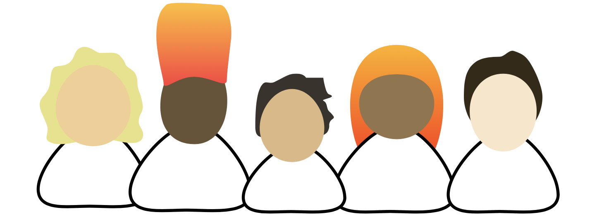

The ethical implications of technological innovation are becoming more and more apparent to us everyday. Whether the discussion is centered around data privacy or workers rights, there is a push towards holding technology accountable. With this, a movement is brewing to combine business with positive impact. A prosperous future for our world lies in sustainable design and products that uplift, but often times these products are not the ones getting the most attention. 

## Why this blog? :thinking:

I've started this blog as a way to document innovative technologies that are being used or could potentially be used as a force for widespread social impact. I define social impact as something that uplifts people and makes the human condition more equitable for all. 

With my experiences learning about the social enterprise space, I noticed there is a gap between how nonprofits approach technology, and how technologists approach nonprofits. Nonprofits might not have the bandwidth for high growth or technology enablement, while technology firms engage in social impact indirectly via CSR and view nonprofits as slow. 

I believe that there is a middle ground between these two worlds that is slowly emerging, but hugely untapped. That is why I am dedicating this blog to analyzing technologies built for potential social impact. I will examine their scalability but also their implications for especially vulnerable people. I will apply a product sense to the technology as well, to see if the technology makes for a sticky, sustainable business. 

## About me :woman_technologist:
I am Vadini Agrawal, a computer science undergraduate student at Georgia Tech. I am a director for the CS + Social Good chapter at Tech, and am a student assistant for the Georgia Tech Institute of Leadership & Entrepreneurship. My interests include product management, entrepreneurship, computer science, and social impact. If you are interested in learning more, visit me at [my website](https://www.vadiniagrawal.com) or reach out to me [here](mailto:vadini@gatech.edu).

I would love to hear your thoughts on my articles as well as engage in discussion on any related topics, so feel free to reach out! 

<!-- Please don't remove this: Grab your social icons from https://github.com/carlsednaoui/gitsocial -->

<!-- display the social media buttons in your README -->

 
<Footer />