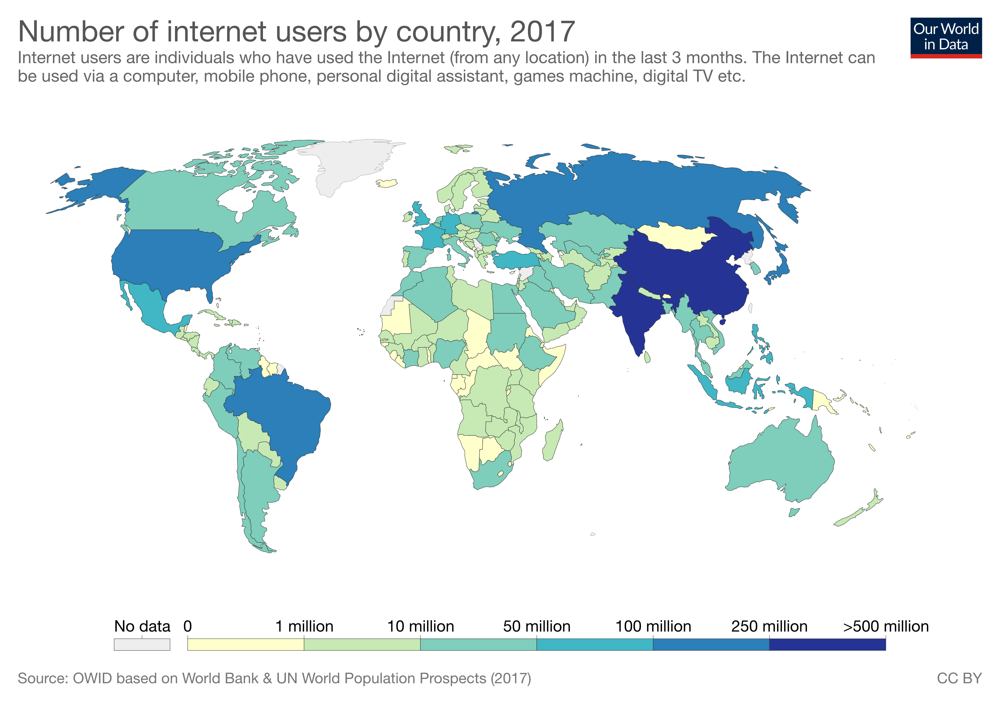

---
# Libra: A Currency for All :moneybag:
July 28, 2019 

On June 18, 2019, Facebook and 28 other organizations boldly announced their intentions to empower billions of people with a digital global currency. This digital global currency is Libra, a form of blockchain to be integrated with Facebook products to give universal access to digital money. It would change the way we pay for things around the world, potentially replacing existing currency. I want to dive deeper into the considerations that Libra should be held accountable to, given how it would affect our lives and economies. 

In a perfect world, Libra could solve a lot of problems. As Mark Zuckerberg quoted himself, around 1 billion people today have a phone but no bank account. This is problematic, as financial services are what drive development by allowing people to invest in health, education, and business. A study in Kenya showed that with access to mobile money, Kenyan women saved a fifth more and developed businesses, ultimately reducing extreme poverty by 22%. Digital financial services could add $3.7 trillion to developing economies [(McKinsey)](https://www.mckinsey.com/~/media/McKinsey/Featured%20Insights/Employment%20and%20Growth/How%20digital%20finance%20could%20boost%20growth%20in%20emerging%20economies/MGI-Digital-Finance-For-All-Executive-summary-September-2016.ashx), and therefore alleviate extreme poverty. 

Even for developed economies, digital currency could free people. Eighty-five percent of the world's transactions are still taking place with cash [(HBR)](https://hbr.org/2016/05/the-countries-that-would-profit-most-from-a-cashless-world), and Americans spend 28 minutes a month getting it. The unbanked are hit the hardest, paying $4 higher for cash access. Businesses, especially mom-and-pop shops, face cash losses on the order of $40 billion yearly [(HBR)](https://hbr.org/2014/06/the-hidden-costs-of-cash). Cash contributes to the growing wealth gap, and a digital currency could fix this. 

 

A global currency could enable people to make international transactions without paying a cut to a transfer agency, which currently costs 7% of a transaction [(HBR)](https://hbr.org/2016/05/the-countries-that-would-profit-most-from-a-cashless-world). It would make it easier to send loved ones money when they work in a different country, as is the case for migrant workers or immigrants. Migrant workers from the Asian-Pacific region sent over $256 billion internationally in 2017, and assuming they paid 7% on that sum, the workers lost $17.92 billion while working often middle-to-low skilled jobs [(Reuters)](https://www.reuters.com/article/us-asia-remittances/migrant-workers-sent-256-billion-home-to-asia-pacific-last-year-un-idUSKBN1I81WV). This is another way that government-backed currency harms vulnerable people, while benefitting middlemen agencies. 

A global digital currency has the potential to benefit the world, based on the above problems we currently face. However, Libra cannot truly empower billions if only developed economies and wealthy people are targeted. Internet infrastructure must be present and reliable to support a global digital economy. Additionally, the user experience on the Libra platform must be accessible by those with low literacy and numeracy [(World Bank)](http://documents.worldbank.org/curated/en/332881525873182837/pdf/126033-PUB-PUBLIC-pubdate-4-19-2018.pdf). This could be challenging if Libra is present only within Facebook services. On the flipside, Facebook’s immense resources could enable accessibility, if prioritized. 

 

Another concern is safety. Consumers must be protected on the platform, where laundering and fraud would be easier due to anonymity [(The Verge)](https://www.theverge.com/2019/6/26/18716326/facebook-libra-cryptocurrency-blockchain-irs-starbucks). Consumers must also have the ability to cash out, since not all places of business will be quick to uptake a digital payments system [(World Bank)](http://documents.worldbank.org/curated/en/332881525873182837/pdf/126033-PUB-PUBLIC-pubdate-4-19-2018.pdf). Libra's white papers vaguely mention plans for physical ATM locations, but no provisions around safety are currently mentioned. The project is in its infancy, as far as the public knows, but its execution in these areas could make or break its utility. 

The efficacy of Libra get more complicated in how it is actually built, and who is building it.

As a cryptocurrency, it is backed by assets in the real world. Libra is backed by around $1 billion in fiat currencies, legal tender backed by a government, and low risk securities [(TechCrunch)](https://www.google.com/amp/s/techcrunch.com/2019/06/06/facebook-libra-launch/amp/). This makes Libra less volatile than normal cryptocurrency, but not completely stable. Due to IRS regulations on cryptocurrency, any profits made from a change in Libra’s value would be taxable, making it a costlier option than pure currency [(The Verge)](https://www.theverge.com/2019/6/26/18716326/facebook-libra-cryptocurrency-blockchain-irs-starbucks). This is a complexity that is not fully addressed in the white papers but could render Libra useless, so we will have to wait and see how the issue plays out in its development. 

Libra.org is a nonprofit, but many organizations have paid money to have a say in it [(TechCrunch)](https://www.google.com/amp/s/techcrunch.com/2019/06/06/facebook-libra-launch/amp/). These include everyone from Facebook to ride-share companies to venture capital firms to social enterprises [(Libra)](https://www.libra.org/). It is, therefore, centralized, and each of the owners have different interests with it. The network aims to become decentralized eventually, but a firm deadline for this is not given [(Forbes)](https://www.forbes.com/sites/enriquedans/2019/06/20/libra-an-interesting-idea-if-only-facebook-werent-involved/#6df154777458). If it fails to do so, a few corporations could be controlling a large portion of global transactions. This could lead to an oligopolization that harms Libras consumers financially or otherwise. This structure is something to watch out for as the organization grows in power. 

 

The currency would primarily be transferred over Facebook products, like Messenger [(Libra)](https://www.libra.org/). However, Facebook has huge incentive to utilize the transaction data to build better profiles of its users for advertisers. With its reputation around data, many experts do not trust Facebook to keep Libra's data separate. To combat this, Facebook created a connector organization Calibra. One of Libra’s founders testified recently that:
   >“[E]xcept in limited circumstances, such as preventing fraud or criminal activity and complying with the law, Calibra will not share customers’ account information or financial data with Facebook **unless people agree to permit such sharing**” [(Forbes)](https://qz.com/1666630/facebooks-david-marcus-testifies-before-the-senate-on-libra/).

This leaves an opportunity for Facebook to make it difficult to opt out of sharing financial data, as Facebook has already done for our personal data. The joint ownership of Libra will hopefully check some of Facebook's power, but until 2020, Facebook still holds the most power in the coalition. 

The Libra organization's squishy structure raises questions about its regulatory status. The organization could be operating like a sort of shadow bank, where it functions like a bank but is not regulated like one [(CPO)](https://www.cpomagazine.com/data-privacy/facebooks-libra-cryptocurrency-could-have-profound-implications-for-personal-privacy/). This has alarmed government officials. The House financial services committee is considering launching a “Keep Big Tech Out Of Finance Act” to stop large tech companies like Facebook from creating currency [(The Guardian)](https://www.theguardian.com/technology/2019/jul/17/facebook-libra-cryptocurrency-congress). In places like Asia, central banks and governments might tax Libra out of effectiveness [(Bloomberg)](https://www.bloomberg.com/opinion/articles/2019-06-20/facebook-s-libra-may-spark-a-cryptocurrency-battle-in-asia). So, Libra will have regulatory hurdles to face in every country they enter. It will be interesting to see how it faces these, and how Libra positions itself in each of the different markets. 

A global digital currency would solve pains felt by a wide number of stakeholders. However, the details of it's execution are tricky. I hypothesize that having Libra run by major for-profit companies might not result in the best outcome for everyone, especially for the most vulnerable groups. I understand, though, that Facebook might be one of the few organizations with a large enough reach to even make Libra work. Still, I am excited to see how smaller startups (such as [DepFi](https://depfi.com/)) develop similar systems and compete with Libra to create even better outcomes for the consumer. 

Libra is a revolutionary idea. Hopefully if accessibility and ethicality are prioritized in its execution, the core mission behind it can become a reality. 

<Footer />
